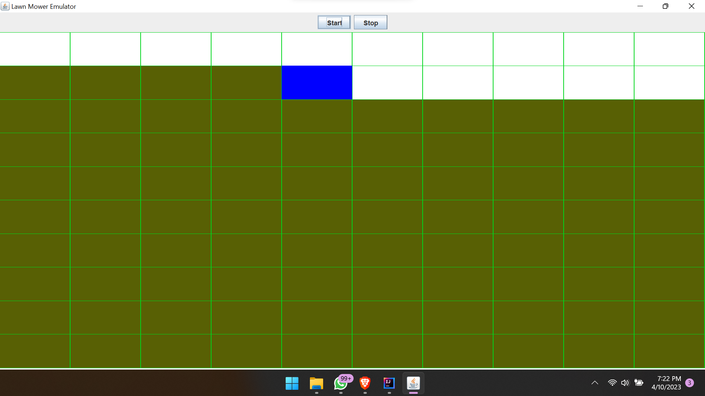

# Lawn Mower Emulator

The Lawn Mower Emulator is a Java program designed to simulate the movement of a lawn mower on a lawn using a graphical user interface. The program uses the Model-View-Controller (MVC) architecture and implements the state and observer design patterns to encapsulate the mower's behavior and notify the observer when the mower reaches the edge of the lawn.

# Features
Simulates the movement of a lawn mower on a lawn
Uses a graphical user interface to display the lawn and the mower
Implements the Model-View-Controller (MVC) architecture
Uses the state and observer design patterns
Allows users to control the movement of the mower
# Usage
To use the Lawn Mower Emulator, follow these steps:

Clone the repository to your local machine.
Open the project in your preferred Java IDE.
Run the LawnMowerEmulator.java file to start the program.
You can also run the jarFile
Click the "Start" button to start the mower.
Use the "Stop" button to stop the mower.
Contributing
If you would like to contribute to the Lawn Mower Emulator project, please follow these steps:

Fork the repository to your own GitHub account.
Clone the repository to your local machine.
Make your changes and test them thoroughly.
Create a pull request to the main repository with a clear description of your changes.
Credits
The Lawn Mower Emulator was created by Raccoon254. Special thanks to the creators of the Java programming language and the various libraries used in this project.

# License
The Lawn Mower Emulator is licensed under the MIT License. See the LICENSE file for details.